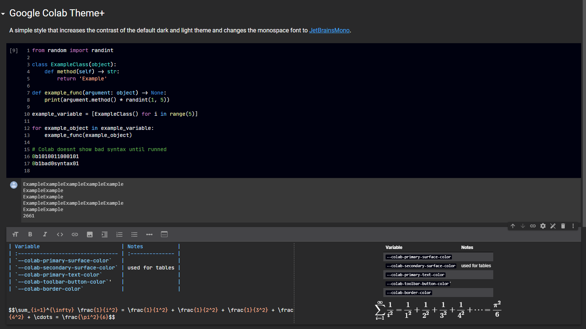
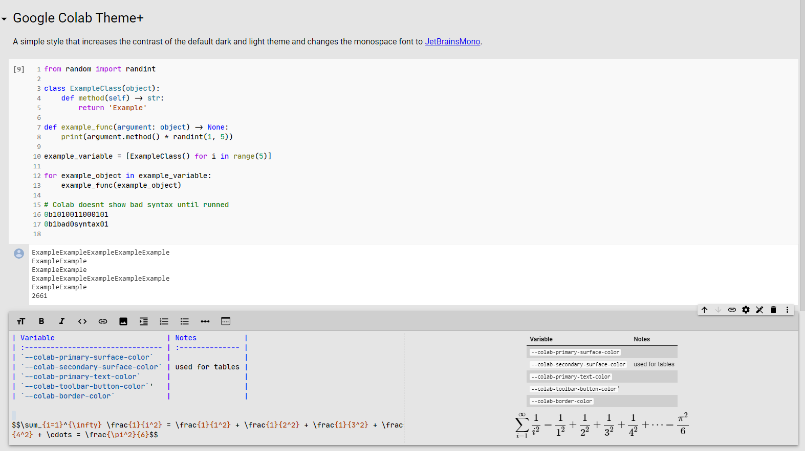
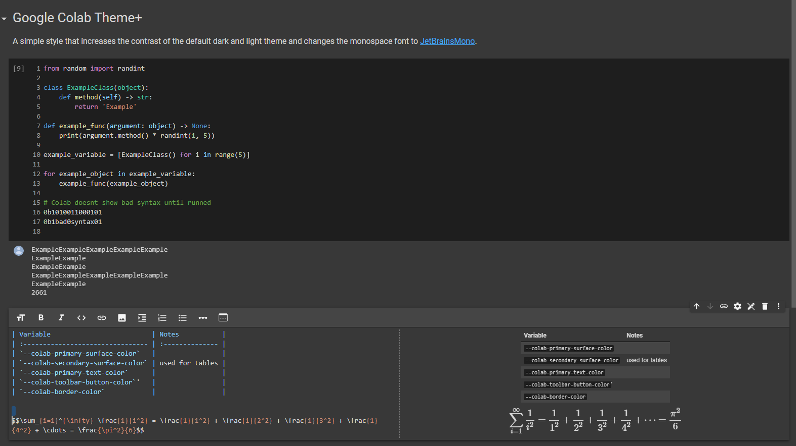
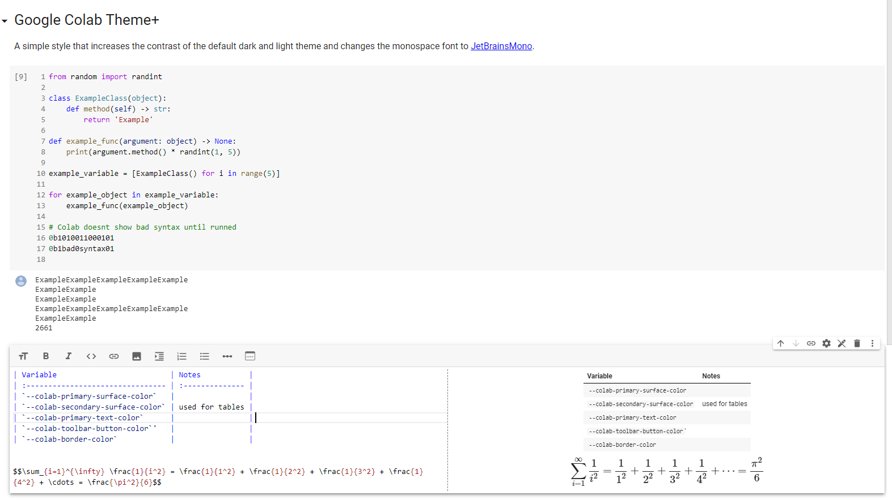

# Colab Theme +

[![Install directly with Stylus]][userstyle]

A simple style that increases the contrast of the default dark and
light theme and changes the monospace font to [JetBrainsMono][JBM].

The theme can be installed with an style manager like [Stylus] by
clicking [this link][userstyle] or by coping [`themeplus.css`][css]
to a new style.

## Images

### Theme +

#### Dark+

#### Light+

### Default Theme

#### Default dark

#### Default light

<!-- URLs -->

[Install directly with Stylus]: https://img.shields.io/badge/Install%20directly%20with-Stylus-285959.svg
[JBM]: https://github.com/JetBrains/JetBrainsMono
[userstyle]: https://raw.githubusercontent.com/benjavicente/colab-theme-plus/master/style/themeplus.user.css
[stylus]: https://github.com/openstyles/stylus
[css]: https://cdn.jsdelivr.net/gh/benjavicente/colab-theme-plus/style/themeplus.css
